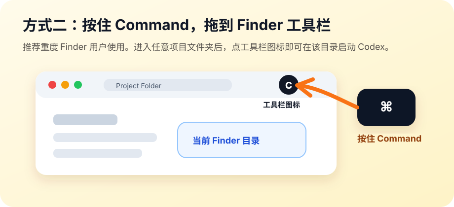

# Codex Now

在 Finder 当前目录一键打开 Terminal，并自动运行：

```bash
codex --dangerously-bypass-approvals-and-sandbox
```

> Inspired by [Claude Code Now](https://github.com/orange2ai/claude-code-now), but built for OpenAI Codex CLI.

## 它解决什么问题？

以前想在某个项目里启动 Codex，通常要这样做：

1. 先建好或找到项目文件夹。
2. 打开 Finder，进入这个文件夹。
3. 再打开 Terminal。
4. 手动 `cd` 到项目目录。
5. 输入 `codex --dangerously-bypass-approvals-and-sandbox`。
6. 遇到目录信任提示时，再手动选择 `1. Yes, continue`。

Codex Now 把这些步骤压缩成一次点击：

1. 在 Finder 里进入你要工作的项目文件夹。
2. 点击 Dock 或 Finder 工具栏里的 `Codex Now` 图标。
3. Terminal 自动在当前文件夹打开，并自动启动 Codex。

适合经常在不同项目目录之间切换、懒得反复打开终端和输入命令的人。

## 功能

- 从当前 Finder 窗口所在目录启动
- 打开 macOS Terminal，而不是 Codex 桌面 App
- 自动执行 `codex --dangerously-bypass-approvals-and-sandbox`
- 自动输入 `1` 并回车，确认 Codex CLI 的目录信任提示
- 可拖到 Dock 或 Finder 工具栏使用
- 使用 `assets/icon.jpg` 生成 App 图标

## 安装

```bash
git clone https://github.com/Yohann1024/codex-now.git
cd codex-now
./install.sh
```

安装后 App 位于：

```text
/Applications/Codex Now.app
```

## 使用

安装完成后，推荐把 `Codex Now.app` 放到 Finder 工具栏。之后进入任何项目文件夹时，点一下工具栏图标即可启动 Codex。

### 按住 Command，拖到 Finder 工具栏



1. 打开 `/Applications`。
2. 找到 `Codex Now.app`。
3. 按住键盘上的 `Command` 键。
4. 在按住 `Command` 的同时，把 `Codex Now.app` 拖到 Finder 窗口顶部工具栏。
5. 之后进入任何项目文件夹时，直接点击 Finder 工具栏里的 `Codex Now` 图标。
6. Terminal 会在这个 Finder 文件夹中打开，并自动运行 Codex。

这个方式最接近“在当前文件夹启动 Codex”的体验：先进入项目目录，再点 Finder 工具栏图标即可。

## 前置要求

需要已安装并登录 OpenAI Codex CLI：

```bash
codex --help
```

如果找不到 `codex`，请先安装或修复 PATH。

## 安全提示

本工具会运行：

```bash
codex --dangerously-bypass-approvals-and-sandbox
```

这个模式会跳过审批和沙箱限制。只建议在你信任的本机项目目录中使用。

## 卸载

```bash
rm -rf "/Applications/Codex Now.app"
rm -f ~/.codex-now-last-dir
```

## 调试

如果偶尔没有自动确认，查看日志：

```bash
tail -n 80 "$HOME/Library/Logs/Codex Now/launcher.log"
```

默认会在启动 Codex 后等待 0.4 秒并向新建 Terminal tab 输入 `1`。这是用全新 `/Volumes/D` 目录实测后的较快稳定值；如果你的机器较慢，可以调大：

```bash
CODEX_NOW_CONFIRM_DELAY=1 open -a "Codex Now"
```

## License

MIT
